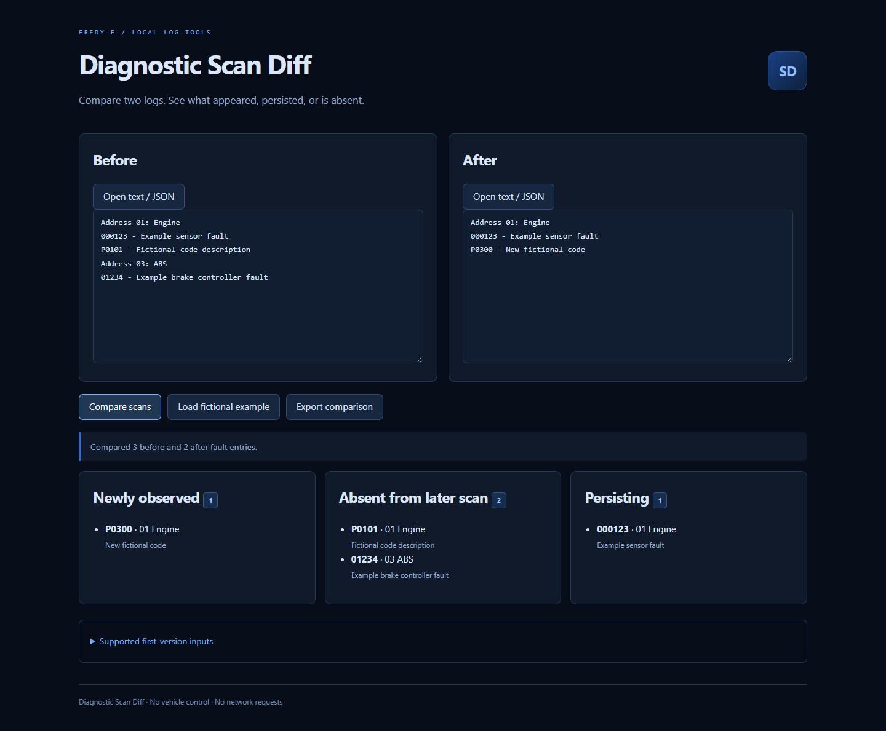

<p align="center">
  
</p>

<p align="center">
  <a href="https://github.com/Fredy-E/Diagnostic-Scan-Diff/actions/workflows/verify.yml"></a>
  
  
  
  
</p>

## What this is

Open `index.html`. Load or paste before/after text logs or JSON fault lists, then compare. The first version groups faults by module and code, collapses duplicates, and exports a JSON comparison.

- Supports common VCDS-style `Address` headers, numeric fault lines, and five-character P/B/C/U codes; unknown log layouts may parse incompletely.
- Redaction of likely VINs and common identifying labels is best effort — review exports before sharing them.
- “Absent from a later scan” describes the log comparison only. It does not certify a repair or interpret vehicle safety.

JSON example:

```json
[{"module":"01 Engine","code":"P0101","description":"Example"}]
```



## Features

- Paste or load before/after text logs (VCDS-style headers, numeric codes, five-character P/B/C/U codes) or JSON fault lists.
- Compares by module and code, collapsing duplicates, and reports newly observed, absent, and persisting faults.
- Best-effort redaction of VINs and common identity labels on file load and before parsing.
- Exports the comparison as JSON; everything is local with no network requests.

## Run

Open `index.html` in a modern browser — no install or server needed. `npm ci` is only required for the test suites.

## Tests

Unit checks (no dependencies):

```sh
node tests/scan.test.cjs
```

Browser end-to-end checks (Playwright 1.63.0, dev-only):

```sh
npm ci
npm run test:browser
```

The browser checks open the app via `file://` and through a loopback-only static server, assert that no request leaves the local machine, run synthetic text and JSON fixtures through the real UI, verify redaction and malformed-input handling, and check that exported JSON matches the last successful comparison (editing inputs invalidates export). On dev machines they use the installed Chrome; in CI they use the bundled Playwright Chromium. Override with `PW_CHANNEL=chrome|msedge|bundled`.

CI (badge above) runs both suites on every push. A manual `pages.yml` workflow prepares a static artifact for GitHub Pages; it does not enable or publish Pages by itself.

## Limits

- Redaction is best effort: review exports before sharing them, and never treat the tool as a data sanitizer.
- “Absent from a later scan” describes the log comparison only — not a repair and not a safety judgement.
- Unknown log layouts may parse incompletely; entries are keyed by module and code, so module header changes can split entries.
- Export reflects the last successful comparison; editing either input disables export until you compare again.

## Next

Real-world (non-synthetic) format fixtures, scan completeness metadata, and richer duplicate/status handling.

## See also

[DriverLens](https://github.com/Fredy-E/DriverLens) · [ARM64 Compatibility Radar](https://github.com/Fredy-E/ARM64-Compatibility-Radar) · [MeshLab Mini](https://github.com/Fredy-E/MeshLab-Mini) · [Offline Museum Kit](https://github.com/Fredy-E/Offline-Museum-Kit) — small local-first tools built for Windows-on-ARM work.
