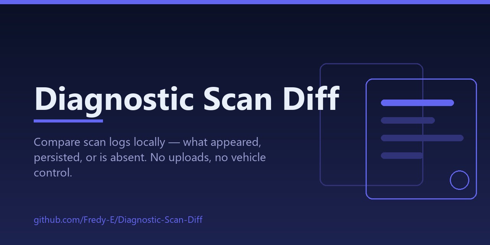

<p align="center">
  
</p>

<p align="center">
  <a href="https://github.com/Fredy-E/Diagnostic-Scan-Diff/actions/workflows/verify.yml"></a>
  
  
  
  
</p>

## What this is

Open `index.html`. Load or paste before/after text logs or JSON fault lists, then compare. The first version groups faults by module and code, collapses duplicates, and exports a JSON comparison.

- Supports common VCDS-style `Address` headers, numeric fault lines, and five-character P/B/C/U codes; unknown log layouts may parse incompletely.
- Redaction of likely VINs and common identifying labels is best effort — review exports before sharing them.
- “Absent from a later scan” describes the log comparison only. It does not certify a repair or interpret vehicle safety.

JSON example:

```json
[{"module":"01 Engine","code":"P0101","description":"Example"}]
```

## Checks

```sh
node tests/scan.test.cjs
```

CI runs the same checks on every push (badge above).

## Next

Real format fixtures, scan completeness metadata, and richer duplicate/status handling.

## See also

[DriverLens](https://github.com/Fredy-E/DriverLens) · [ARM64 Compatibility Radar](https://github.com/Fredy-E/ARM64-Compatibility-Radar) · [MeshLab Mini](https://github.com/Fredy-E/MeshLab-Mini) · [Offline Museum Kit](https://github.com/Fredy-E/Offline-Museum-Kit) — small local-first tools built for Windows-on-ARM work.
